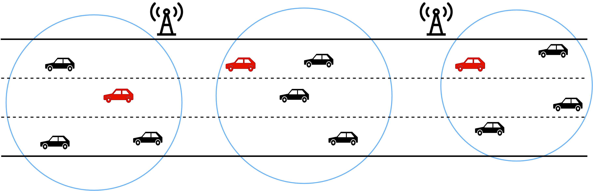
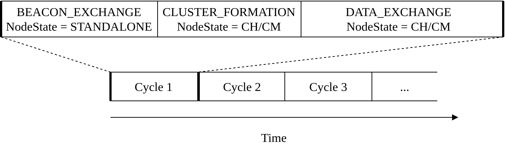
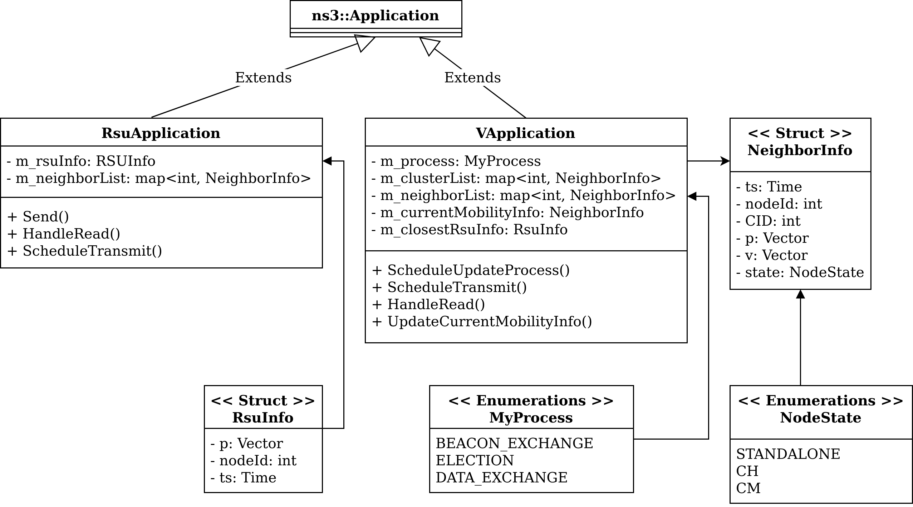
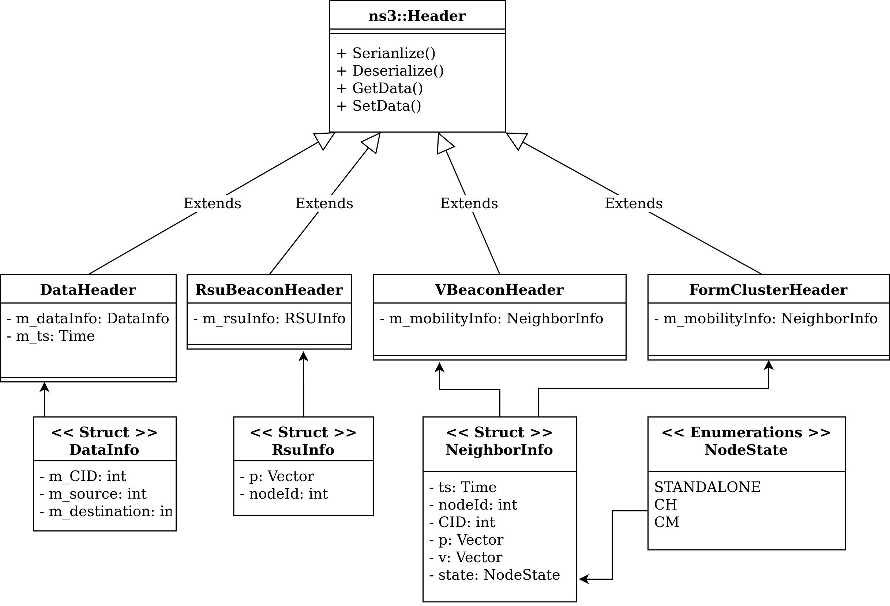
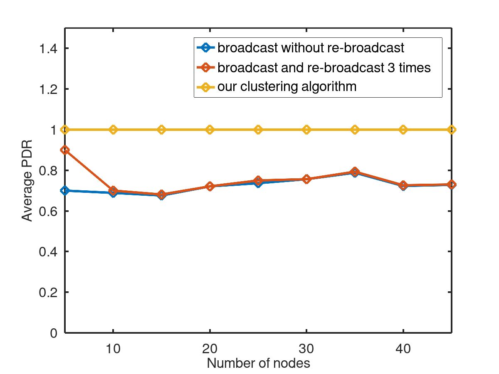
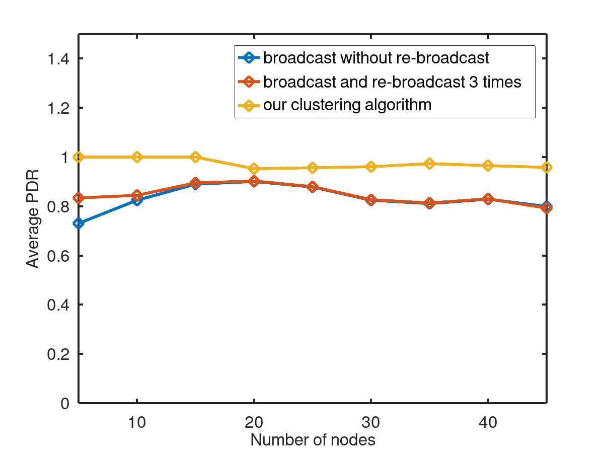
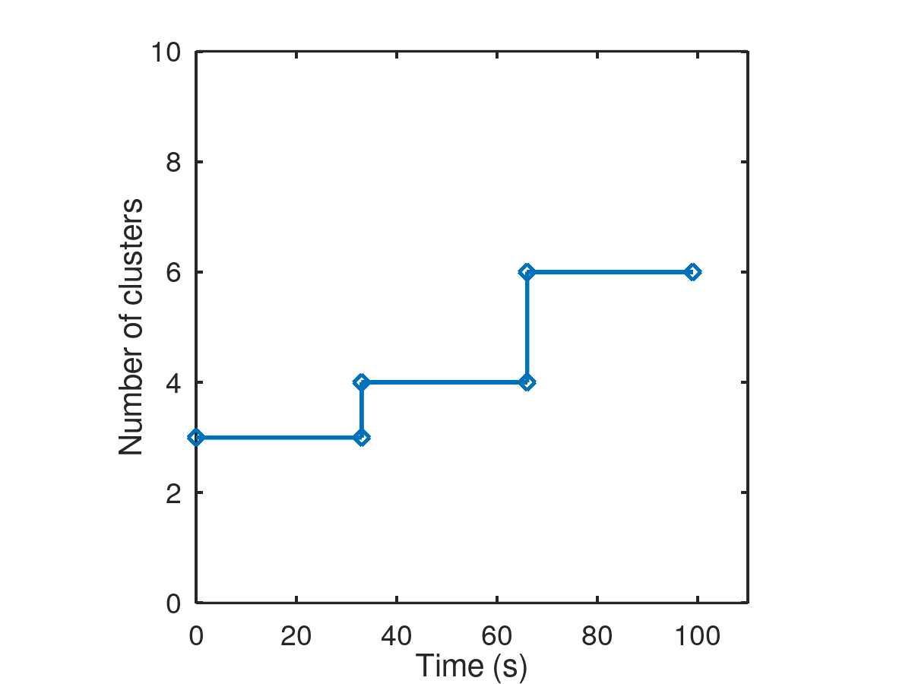

## Overview

I.  Introduction

II.  Methodologies
III.  Tools and Implementation
IV.  Results
V.  Conclusion and Future Works

# I. Introduction

## 1 - Introduction to VANETs

{width=80%}

## 2 - Connectivity Problem & Solution

- Problems: Communication overhead/failures
- Solution: **Cluster Establishment**

## 3 - Objectives

- Constructing the protocol in each **process**.

- Implementing the protocol on **NS-3** simulator.

- Running the simulation and analysing the **results**.

# II. Methodologies

## 1 - Protocol Description

Construct:

- NodeState
- Time Cycle
- Algorithms

## 2 - Protocol Description

{width=100%}

## 3 - BEACON_EXCHANGE Process

Nodes:

- broadcast **beacon messages**

- update their table of stable neighbors

- keep track with the closest RSU

## 4 - CLUSTER_FORMATION Process

Node:

- waits to become a CH

- joins other cluster if it receives FormClusterMessage

- otherwise, declares itself as CH.

## 5 - DATA_EXCHANGE Process

- Intra-cluster communication
  - Direct transmission
  - Indirect transmission
- Inter-cluster communication
  - CH roles: forward packet to nearest RSU
  - RSU roles: forward packet to the destination cluster
  - Core network

# III. Tools and Implementations

## 1 - NS-3 Network Simulator

>**NS-3** simulator is a discrete-event network simulator targeted primarily for research and educational use.`

\begin{multicols}{2}
  \begin{itemize}
    \item Simulates the real world network on computer
    \item C++, Python
    \item Maintains an implementation for WAVE
  \end{itemize}\par
  \includegraphics[width=0.8\linewidth]{ns3.png}\par
\end{multicols}

## 2 - Implementation

- **Applications**: for vehicles and for RSUs

- **Headers**: for different packet types

## 2 - Implementation

{width=100%}

## 2 - Implementation

{width=90%}

# IV. Results

## 1 - Scenarios Descriptions

- Scenarios:
  - Stable
  - Non-stable
- Metrics:
  - PDR: Packet Delivery Ratio

## 1 - Scenarios Descriptions

\centering
{width=70%}

| Parameter                          | Value                     |
|------------------------------------|---------------------------|
| Position range                     | [0m, 100m]                |
| Mobility Model                     | Constant Velocity         |
| Simulation Time                    | 33s                       |
| Number of Vehicles                 | 5/10/15/20/25/30/35/40/45 |
| Distance between two adjacent RSUs | 100m                      |
Table: Common configuration parameters of the clustering scenarios

## 2 - Stable Scenario

{width=90%}

## 3 - Non-stable Scenario

{width=90%}

## 4 - Analysis on Cycle Time Value

{width=80%}

## 4 - Analysis on Cycle Time Value

\begin{figure}[htbp]
\subfloat[]{\includegraphics[width=0.5\linewidth]{numCID_10s.png}}
\subfloat[]{\includegraphics[width=0.5\linewidth]{numCID_20s.png}}
\caption{Number of clusters created in the first 100 seconds of simulation with cycle time is (a) 13 seconds and (b) 23 seconds}
\end{figure}

## V. Conclusion and Future Work

- **Inter-cluster** communication implementations
- More practical **scenarios**
- Proper values for algorithm specific **parameters**

## {.standout}

Thank you for listening!
